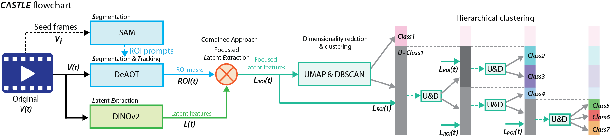

[](https://arxiv.org/abs/<INDEX>)
[](https://badge.fury.io/py/castle-ai)
[](https://github.com/CASTLE-ai/castle-ai/actions/workflows/ci.yml)
[](https://colab.research.google.com/github/CASTLE-ai/castle-ai/blob/main/notebooks/colab.ipynb)
[](LICENSE)
[](https://pepy.tech/projects/castle-ai)
[](https://pepy.tech/projects/castle-ai)





**CASTLE (Combined Approach for Segmentation and Tracking with Latent Extraction)** is a training-free framework that combines segmentation models, tracking algorithms, and visual foundation models to automatically discover animal behaviors from video. Through focused latent extraction and hierarchical clustering, it achieves expert-level accuracy across multiple species without manual labeling, while uncovering previously hidden behavioral patterns that keypoint methods miss.

<p align="center">
  
</p>

## Latest updates
- 2024-09: Public release of this tool.


## Step 1 Install CASTLE Core Function
```
pip install torch==2.3.0+cu121 torchvision torchaudio --index-url https://download.pytorch.org/whl/cu121

pip install castle-ai
```


## Step 2 Install xFormer and GPU Version of UMAP (Optional for Speed Up)

For CUDA 12 Users
```
pip install -U xformers --index-url https://download.pytorch.org/whl/cu121
pip install -U cudf-cu12 cuml-cu12 --extra-index-url=https://pypi.nvidia.com 
```

## Step 3 Download Web UI
```
git clone https://github.com/CASTLE-ai/castle-ai.git
```

## Step 4 Download Pretrained Model

```
cd castle-ai/
mkdir ckpt
```

Then, download the models from the web by copying the links to the Chrome browser and downloading them.
```
https://dl.fbaipublicfiles.com/segment_anything/sam_vit_b_01ec64.pth
https://dl.fbaipublicfiles.com/dinov2/dinov2_vitb14/dinov2_vitb14_reg4_pretrain.pth
https://drive.google.com/file/d/1g4E-F0RPOx9Nd6J7tU9AE1TjsouL4oZq/edit
https://drive.google.com/file/d/1QoChMkTVxdYZ_eBlZhK2acq9KMQZccPJ/edit
```

Afterward, place them into the ckpt folder.

```
castle-ai
├── castle
└── ckpt
    ├── dinov2_vitb14_reg4_pretrain.pth
    ├── R50_DeAOTL_PRE_YTB_DAV.pth
    ├── sam_vit_b_01ec64.pth
    └── SwinB_DeAOTL_PRE_YTB_DAV.pth

```


## Run
```
python app.py
```

## About us

CASTLE is a project by the [Wu Lab](https://www.yuweiwu.org/), a research group at the [Academia Sinica](https://www.sinica.edu.tw/en).


## Credits & Licenses

This project incorporates code and methodologies from the following sources:

- SAM (Segment Anything Model): https://github.com/facebookresearch/segment-anything (Apache License 2.0)
- DeAOT (Decoupling Features in Hierarchical Propagation): https://github.com/yoxu515/aot-benchmark (BSD 3-Clause License)
- DINOv2 (Self-Supervised Vision Transformer): https://github.com/facebookresearch/dinov2 (Apache License 2.0)

This work is distributed under the terms of the Apache License 2.0.


## Citation

If you find this work useful, please consider citing:

```bibtex
@article{CASTLE,
  title={CASTLE: a training‑free foundation‑model pipeline for unsupervised, cross‑species behavioral classification},
  author={Liu, Yu-Shun and Yeh, Han-Yuan and Hu, Yu-Ting and Wu, Bing-Shiuan and Chen, Yi-Fang and Yang, Jia-Bin and Jasmin, Sureka and Hsu, Ching-Lung and Lin, Suewei and Chen, Chun-Hao and Wu, Yu-Wei},
  journal={TBD},
  year={2025}
}
