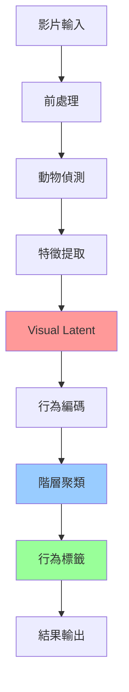
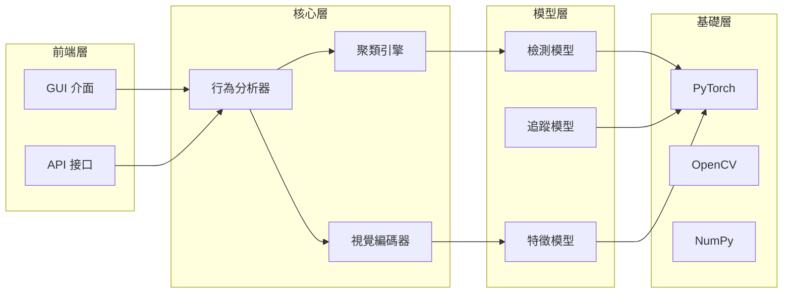

# 核心概念

深入了解 CASTLE 背後的理論基礎和技術原理，這些知識將幫助您更好地理解和使用 CASTLE 進行動物行為分析。

## 🎯 學習目標

完成本章節後，您將：

- [x] 理解 CASTLE 的整體架構設計
- [x] 掌握 Focused Visual Latent 的核心概念
- [x] 了解階層式聚類在行為分析中的應用
- [x] 具備深入使用 CASTLE 的理論基礎

## 📚 概念模組

### 🏗️ [CASTLE 架構](architecture.md)
**學習時間**: 20 分鐘 | **難度**: 🌟 初級

了解 CASTLE 系統的整體設計理念和模組化架構：

- 系統架構概覽
- 各模組功能與職責
- 資料流程與處理管線
- 擴展性與自訂化設計

**適合對象**: 所有使用者

---

### 👁️ [Focused Visual Latent](visual-latent.md)
**學習時間**: 30 分鐘 | **難度**: 🌟🌟 中級

深入理解 CASTLE 核心的視覺特徵提取技術：

- 視覺潛在空間的概念
- 特徵提取與表示學習
- 空間注意力機制
- 多尺度特徵融合

**適合對象**: 有機器學習基礎的使用者

---

### 🌳 [階層式聚類](hierarchical-clustering.md)
**學習時間**: 30 分鐘 | **難度**: 🌟🌟 中級

學習如何通過階層式聚類識別動物行為模式：

- 階層聚類基礎原理
- 行為模式的自動發現
- 聚類參數調整策略
- 結果解釋與驗證

**適合對象**: 需要深入分析行為的使用者

---

### 🧠 [演算法詳解](algorithm-deep-dive.md)
**學習時間**: 60 分鐘 | **難度**: 🌟🌟🌟 進階

深度剖析 CASTLE 核心演算法的實作細節：

- 深度學習模型架構
- 訓練策略與優化技術
- 推理過程與效能優化
- 演算法改進與擴展

**適合對象**: 研究人員和進階開發者

## 🔄 學習順序建議

### 初學者路徑
```
1. CASTLE 架構 → 2. Visual Latent 基礎 → 3. 實作練習
```

### 研究者路徑
```
1. 所有概念模組 → 2. 演算法詳解 → 3. 客製化開發
```

### 應用導向路徑
```
1. CASTLE 架構 → 2. 階層式聚類 → 3. 實際專案
```

## 💡 核心概念圖解

### CASTLE 工作流程



### 技術棧架構



## 🔬 理論背景

### 動物行為分析的挑戰

1. **行為的複雜性**: 動物行為具有多層次、多模態的特性
2. **個體差異性**: 不同個體間的行為表現存在差異
3. **時空相關性**: 行為在時間和空間上具有複雜的相關關係
4. **標註困難**: 人工標註行為耗時且主觀性強

### CASTLE 的解決方案

1. **無監督學習**: 減少對標註資料的依賴
2. **表示學習**: 學習富含行為資訊的特徵表示
3. **階層建模**: 捕捉不同層次的行為模式
4. **端到端優化**: 整合檢測、追蹤、分析於一體

## 📊 概念比較

### 傳統方法 vs CASTLE

| 比較面向 | 傳統方法 | CASTLE |
|----------|----------|---------|
| **資料需求** | 大量標註資料 | 無需標註 |
| **特徵工程** | 手工設計特徵 | 自動學習特徵 |
| **行為定義** | 預定義類別 | 自動發現模式 |
| **適應性** | 特定場景 | 跨物種通用 |
| **可解釋性** | 規則明確 | 視覺化解釋 |

### 與其他工具對比

| 工具 | 優勢 | 限制 | CASTLE 改進 |
|------|------|------|-------------|
| **DeepLabCut** | 姿態精確 | 需要標註 | 無監督分析 |
| **SLEAP** | 多動物支援 | 計算複雜 | 輕量化設計 |
| **BORIS** | 功能全面 | 手工標註 | 自動化流程 |

## 🛠️ 實作原則

### 設計哲學

1. **簡單易用**: 最小化使用門檻
2. **功能強大**: 滿足複雜分析需求  
3. **可擴展**: 支援客製化開發
4. **高效能**: 優化計算效率

### 技術選擇

- **深度學習框架**: PyTorch (靈活性 + 效能)
- **電腦視覺**: OpenCV (成熟穩定)
- **數值運算**: NumPy + SciPy (高效率)
- **視覺化**: Matplotlib + Plotly (豐富圖表)

## 🎓 深入學習建議

### 推薦論文

1. **視覺表示學習**
   - "Representation Learning: A Review and New Perspectives"
   - "Deep Visual Representation Learning"

2. **行為分析**
   - "Computational Analysis of Animal Behavior"
   - "Machine Learning for Animal Behavior Analysis"

3. **聚類算法**
   - "Hierarchical Clustering: A Survey"
   - "Density-Based Clustering Methods"

### 相關課程

- **機器學習基礎**: 了解基本概念和方法
- **電腦視覺**: 掌握影像處理技術
- **動物行為學**: 理解生物學背景

## 📝 概念檢驗

### 自我檢測題目

1. **基礎理解**
   - 什麼是 Focused Visual Latent？
   - 階層式聚類如何發現行為模式？
   - CASTLE 相比傳統方法有哪些優勢？

2. **應用思考**
   - 如何針對特定物種調整 CASTLE 參數？
   - 在什麼情況下需要客製化分析管線？
   - 如何驗證分析結果的可靠性？

3. **深度探索**
   - 如何改進現有的聚類算法？
   - 如何整合多模態資訊？
   - 如何提升計算效率？

---

## 🚀 開始學習

準備好深入了解 CASTLE 的核心技術了嗎？從系統架構開始，逐步建立完整的理論基礎！

**推薦學習路徑**: [開始學習 CASTLE 架構 →](architecture.md){ .md-button .md-button--primary }

**需要實作練習？**: [查看實際範例 →](../species/mouse-behavior.md){ .md-button }

!!! tip "學習建議"
    - 結合理論學習與實際操作
    - 嘗試不同的參數設定
    - 參與社群討論交流經驗
    - 閱讀相關研究論文

!!! info "更多資源"
    - [API 詳細文件](../../api/)
    - [進階教學](../advanced/)
    - [社群討論區](../../community/)