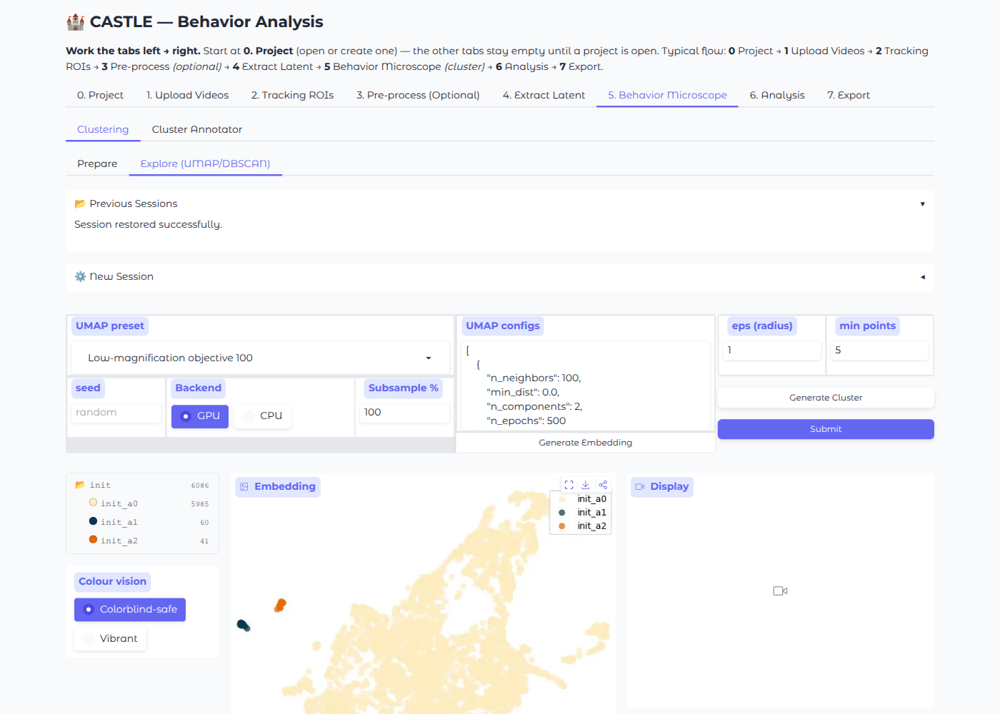

# Step 4: Behavior Analysis

The **5. Behavior Microscope** tab is where CASTLE's core analysis happens — transforming latent features into interpretable behavioral categories through dimensionality reduction and clustering.

The tab contains two sub-tabs:

- **Clustering** — UMAP + DBSCAN workspace, with a **Prepare** sub-tab (optional reduced latent cache) and an **Explore (UMAP/DBSCAN)** sub-tab
- **Cluster Annotator** — grid video browser with behavior labeling, comments, and auto-save

---

## Overview

The analysis workflow:

```
Latent Vectors → Initialize → Select Cluster → UMAP Embedding → DBSCAN Clustering → Submit (auto-label)
                                                                                           ↓
                                                              Cluster Annotator (grid video, label, comment)
```

This is an **iterative, hierarchical** process. You start with broad categories (low magnification) and progressively zoom in to discover finer behavioral syllables.

!!! warning "Human-in-the-loop is required"
    The Behavior Microscope UI intentionally provides **no one-click cluster entry point** (the `castle cluster run` CLI runs UMAP + DBSCAN + auto-label + submit for scripted use, but its output needs the same review) — every cluster boundary and label must be reviewed by the user in the Behavior Microscope tab. A cluster is only scientifically meaningful after you have (1) inspected representative frames, (2) verified the boundary by adjusting `eps`, and (3) assigned a behavioural label.

---

## Getting Started

### Initialize

1. Switch to the **5. Behavior Microscope** tab → **Clustering** → **Explore (UMAP/DBSCAN)**
2. In the **⚙️ New Session** accordion, configure:

    | Parameter | Description | Default |
    |-----------|-------------|---------|
    | **Select Visual Model** | Must match the model used in Step 3 | `dinov3_vitb16` |
    | **Enter ROI ID** | Comma-separated list (e.g., `1` or `1,2,3`) | `1` |
    | **Time window (frame)** | Number of frames to aggregate per data point | `1` |
    | **Latent pooling** | Which extracted-latent variant to use (`auto`, `weighted_average`, `multiscale`); legacy raw only | `auto` |
    | **Data source** | A prepared cache built in the **Prepare** sub-tab, or legacy raw latents (model, pooling and ROI are hidden when a cache is picked) | `(legacy raw — no cache)` |
    | **Explained variance % (PCA → UMAP)** | Prepared cache only: % of variance kept, which sets the number of PCA dims fed to UMAP | `95` |

3. Click **Initialize**

!!! note "Time Window"
    A time window of `1` means each data point represents a single frame. Higher values (e.g., `5` or `10`) aggregate consecutive frames, which can smooth noise and capture temporal patterns but reduces temporal resolution.

---

## UMAP Configuration

CASTLE provides **magnification presets** that control how the UMAP dimensionality reduction is performed. The key idea: different `n_neighbors` values reveal structure at different scales.

### Presets

#### Low Magnification (Single-Stage UMAP)

Broad behavioral categories. Single UMAP step reducing directly to 2D.

Available presets with different `n_neighbors` values:

| Preset | n_neighbors | Use Case |
|--------|------------|----------|
| Low-magnification objective 1000 | 1000 | Very broad categories, large datasets |
| Low-magnification objective 500 | 500 | Broad categories |
| Low-magnification objective 300 | 300 | Moderate categories |
| Low-magnification objective 100 | 100 | Default starting point |
| Low-magnification objective 50 | 50 | Finer categories |
| Low-magnification objective 25 | 25 | Fine categories, small datasets |

Configuration format:
```json
[
    {
        "n_neighbors": 100,
        "min_dist": 0.0,
        "n_components": 2,
        "n_epochs": 500
    }
]
```

#### Intermediate Magnification (Two-Stage UMAP)

Two-step reduction: first to 5D, then to 2D. Captures more structure than single-stage.

| Preset | Stage 1 n_neighbors | Stage 2 n_neighbors |
|--------|--------------------|--------------------|
| Intermediate-magnification objective (1000, 500) | 1000 | 500 |
| Intermediate-magnification objective (500, 300) | 500 | 300 |
| Intermediate-magnification objective (300, 100) | 300 | 100 |
| Intermediate-magnification objective (100, 50) | 100 | 50 |
| Intermediate-magnification objective (50, 25) | 50 | 25 |

Configuration format:
```json
[
    {"n_neighbors": 300, "min_dist": 0.0, "n_components": 5, "n_epochs": 500},
    {"n_neighbors": 100, "min_dist": 0.0, "n_components": 2, "n_epochs": 500}
]
```

#### High Magnification (Two-Stage, Higher Initial Dimension)

Two-step reduction: first to 10D, then to 2D. Preserves the most structure for fine-grained analysis.

| Preset | Stage 1 n_neighbors | Stage 2 n_neighbors |
|--------|--------------------|--------------------|
| High-magnification objective (1000, 500) | 1000 | 500 |
| High-magnification objective (500, 300) | 500 | 300 |
| High-magnification objective (300, 100) | 300 | 100 |
| High-magnification objective (100, 50) | 100 | 50 |
| High-magnification objective (50, 25) | 50 | 25 |

Configuration format:
```json
[
    {"n_neighbors": 300, "min_dist": 0.0, "n_components": 10, "n_epochs": 500},
    {"n_neighbors": 100, "min_dist": 0.0, "n_components": 2, "n_epochs": 500}
]
```

#### Super-High Magnification (Three-Stage UMAP)

Three-step reduction: 15D, then 5D, then 2D.

| Preset | Stage 1 n_neighbors | Stage 2 n_neighbors | Stage 3 n_neighbors |
|--------|--------------------|--------------------|--------------------|
| Super-high-magnification objective (500, 300, 100) | 500 | 300 | 100 |
| Super-high-magnification objective (300, 100, 50) | 300 | 100 | 50 |
| Super-high-magnification objective (100, 50, 25) | 100 | 50 | 25 |

### Custom Configuration

You can edit the UMAP config JSON directly for full control. The format is a list of UMAP stages, each with:

- `n_neighbors`: number of nearest neighbors (larger = broader structure)
- `min_dist`: minimum distance between points in embedding (0.0 for clustering)
- `n_components`: output dimensions for that stage
- `n_epochs`: optimisation epochs (the presets use `500`)

!!! note "`standardize` is a legacy no-op"
    Older configs/presets may include a `"standardize"` key. Per-feature input
    standardization was **removed**; the key is now accepted but **ignored**
    (dropped before UMAP), so leaving it in a saved config is harmless and has no
    effect on the embedding.

---

## Running the Analysis

### 1. Generate Embedding

1. Click a node in the **Cluster Tree** (starts with `init` — the full dataset)
2. Choose a UMAP preset or edit the config manually
3. Click **Generate Embedding**

The UMAP scatter plot appears on the right. Each point represents a data point (frame or time window).


!!! tip "Interactive Exploration"
    Click on any point in the UMAP plot to play a short video clip around the corresponding frame. This helps you understand what each region of the embedding represents.

!!! note "Reproducible embeddings"
    Each run records its resolved **UMAP seed**, shown in the status line below the plot. Leave the **seed** field blank to draw a fresh seed each run, or paste a previously logged seed to reproduce a layout. Every UMAP stage is also recorded as one JSON line (seed + config) in a per-session `umap_log.jsonl` file. For **bit-identical** reproduction, reuse the logged seed with the **CPU** backend (umap-learn) — the **GPU** backend (cuML) is fast but its layout may vary slightly run-to-run.

### 2. Cluster the Embedding

1. Set the **epsilon-neighborhood radius** (eps) — controls cluster granularity
    - Smaller eps → more clusters (finer categories)
    - Larger eps → fewer clusters (broader categories)
    - Range: 0.1 to 10.0 (default: 1.0)
2. Click **Generate Cluster**

The plot updates with colors indicating cluster assignments.

### 3. Label Clusters

Cluster names are assigned automatically when you click **Submit**: every DBSCAN cluster (noise `-1` excluded) gets a hierarchical name built from its parent — children of `init` become `init_a0`, `init_a1`, …; children of `init_a0` become `init_a0_b0`, …. Behavior labels are assigned afterwards in the [Cluster Annotator](#cluster-annotator-sub-tab).

!!! tip
    Click on points within each cluster to view representative frames. This helps you identify what behavior each cluster represents.

### 4. Submit

Click **Submit** to:

- Auto-label every cluster (see above)
- Import the labeled clusters into the main analysis
- Generate a syllable plot (ethogram)
- Export CSV files (behavior IDs and time series)
- Generate SRT subtitle files for video overlay
- Save the embedding data

---

## Hierarchical Analysis

The power of CASTLE's "Behavior Microscope" comes from iterative refinement:

1. **Start broad**: use Low Magnification to identify major behavioral categories
2. **Zoom in**: select a specific cluster, then re-run UMAP at Intermediate or High Magnification
3. **Refine**: each cluster can be further subdivided into finer syllables
4. **Repeat**: continue until you reach the desired granularity

This mirrors how a microscope works — you start with low magnification to find areas of interest, then zoom in for detail.


---

## Outputs

After submitting, the following are generated:

| Output | Format | Description |
|--------|--------|-------------|
| **Syllable Plot** | Interactive plot | Timeline of behavioral states |
| **Behavior ID CSV** | `.csv` | Mapping of cluster IDs to names |
| **Time Series CSV** | `.csv` | Frame-by-frame cluster assignments |
| **SRT Subtitles** | `.srt` | Behavioral labels as video subtitles |
| **Embedding NPZ** | `.npz` | UMAP coordinates and cluster labels |

!!! note "Ethogram and time series are per video"
    Ethogram results are computed **per video** — one ethogram per animal/video, each from that video's own per-frame assignments. Time series CSVs and SRT subtitles are likewise written per video, with no cross-video pooling of bouts or transitions.

---

## Cluster Annotator Sub-tab

After generating clusters, use the **Cluster Annotator** sub-tab to review and label them:

1. Switch to the **Cluster Annotator** sub-tab within **5. Behavior Microscope**
2. Select the clustering session from the dropdown and click **Load Cluster Data**
3. A list of clusters appears on the left panel
4. Click a cluster to load its **grid video** — a mosaic of representative video clips

### Labeling

- Pick a **Behavior Label** from the selected **Classification Scheme** (default `mice-10-class`; add your own under **✏️ Custom Scheme**). The label is stored in the session's `annotations.csv` next to the auto-generated cluster name
- Optionally add a **comment** to describe the behavior or note uncertainty
- Labels are **auto-saved** immediately on change; comments are auto-saved on focus-out

### Mask Contour Overlay

When tracking data is available, ROI mask contours are drawn over the video frames so you can confirm the tracked region corresponds to the animal.

---

## Colour vision

A **Colour vision** toggle in the Explore panel switches the cluster palette
between **Colorblind-safe** (Okabe-Ito, the default) and **Vibrant**. The same
mode colours the cluster tree, the embedding scatter, the ethogram, and the
exported publication figures, so what you see while exploring matches what you
publish. The choice applies for the session; set a default for headless/CLI runs
with the `CASTLE_COLOR_MODE` environment variable
(see [Environment Variables](../technical/environment-variables.md)).



---

## Tips

- **Start with Low Magnification 100** as your first exploration
- **eps = 1.0** is a good starting point for clustering
- If clusters are too noisy, try a **larger n_neighbors** value
- If behaviors are merged together, try **higher magnification** or **smaller eps**
- Use **multiple videos** for more robust clustering — single-video embeddings can overfit to that animal's quirks
- The first round of labeling (cold start) takes ~30 min of interactive exploration; subsequent rounds are much faster (~3 min) once you know what to look for
- Save your UMAP settings once you find a configuration that works for your experimental paradigm — you can reuse them across projects
- If the UMAP plot looks like a single blob with no structure, try a **smaller n_neighbors** (e.g., 25–50) or switch to **Intermediate/High magnification**

---

## Next Step

After labeling clusters, explore downstream analysis in **6. Analysis** (Ethogram, Quality Metrics, Group Comparison), then proceed to [**Step 5: Export Results**](step5-export.md).
